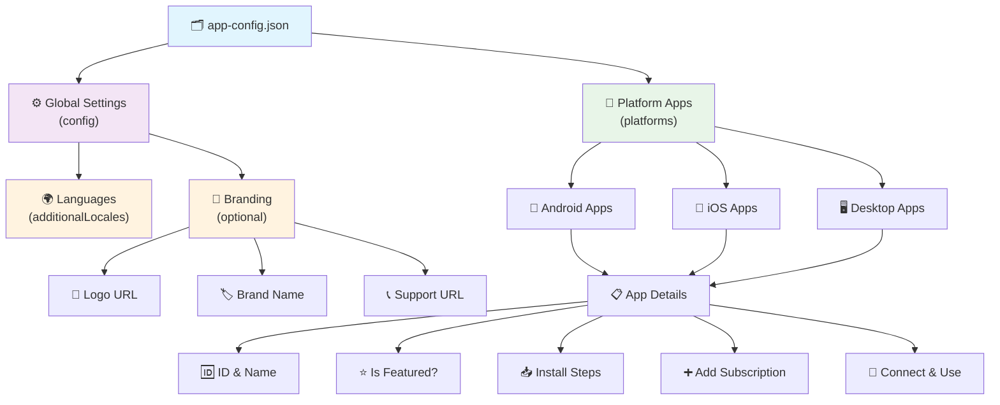

# Remnawave Subscription Page

Remnawave Subscription Page is lightweight and secure way to hide your Remnawave Panel domain from end users. You can use it as a simple and beautiful subscription page for your users.


## Step 1 - Prepare .env file

Edit the `/opt/remnawave/.env` file and change `SUB_PUBLIC_DOMAIN` to your subscription page domain name.

```bash title="Editing .env file"
cd /opt/remnawave && nano .env
```

Change `SUB_PUBLIC_DOMAIN` to your subscription page domain name. Domain name must be without http or https.

```bash title=".env file content"
SUB_PUBLIC_DOMAIN=subscription.domain.com
```

## Step 2 - Create docker-compose.yml file

```bash title="Creating docker-compose.yml file"
mkdir -p /opt/remnawave/subscription && cd /opt/remnawave/subscription && nano docker-compose.yml
```

```yaml title="docker-compose.yml file content"
services:
    remnawave-subscription-page:
        image: remnawave/subscription-page:latest
        container_name: remnawave-subscription-page
        hostname: remnawave-subscription-page
        restart: always
        environment:
        // highlight-next-line-yellow
            - REMNAWAVE_PANEL_URL=https://panel.com
            - APP_PORT=3010
            - META_TITLE="Subscription Page Title"
            - META_DESCRIPTION="Subscription Page Description"
        ports:
            - '127.0.0.1:3010:3010'
        networks:
            - remnawave-network

networks:
    remnawave-network:
        driver: bridge
        external: true
```

:::danger

Please replace `panel.com` with the URL at which the **Remnawave Dashboard** is available.

`REMNAWAVE_PANEL_URL` can be http (bridged Remnawave, example: `http://remnawave:3000`) or https (example: `https://panel.com`).

:::

:::tip
You can replace it parameter with, for example,

```bash
- CUSTOM_SUB_PREFIX=sub
```

to get an additional nested path for the subscription page.
But in that case, in the `.env` file for the `remnawave` container, you will need to set the corresponding parameter correctly: `SUB_PUBLIC_DOMAIN=link.domain.com/sub`.
And you will need to specify similar changes to the valid path in your configurations for Nginx/Caddy.

:::

<details>
<summary>Full .env file reference</summary>

```bash title=".env file"
APP_PORT=3010

### Remnawave Panel URL, can be http://remnawave:3000 or https://panel.example.com
REMNAWAVE_PANEL_URL=https://panel.example.com


META_TITLE="Subscription page"
META_DESCRIPTION="Subscription page description"


# Serve at custom root path, for example, this value can be: CUSTOM_SUB_PREFIX=sub
# Do not place / at the start/end
CUSTOM_SUB_PREFIX=


# Support Marzban links
MARZBAN_LEGACY_LINK_ENABLED=false
MARZBAN_LEGACY_SECRET_KEY=
REMNAWAVE_API_TOKEN=


# If you use "Caddy with security" addon, you can place here X-Api-Key, which will be applied to requests to Remnawave Panel.
CADDY_AUTH_API_TOKEN=
```

</details>

## Step 3 - Start the container

```bash title="Starting the container"
docker compose up -d && docker compose logs -f
```

## Step 4 - Configure reverse proxy

:::warning

Remnawave and its components does not support being server on a sub-path. (e.g. `location /subscription {`)

It has to be served on the root path of a domain or subdomain.

For custom path, you can use the `CUSTOM_SUB_PREFIX` parameter.

:::

### Caddy

<details>
<summary>Caddy configuration</summary>

If you have already configured Caddy all you need to do is add a new site block to the Caddyfile.

```bash title="Editing Caddyfile"
cd /opt/remnawave/caddy && nano Caddyfile
```

:::warning

Please replace `SUBSCRIPTION_PAGE_DOMAIN` with your domain name.

Review the configuration below, look for green highlighted lines.

:::

:::danger

Do not fully replace the existing configuration, only add a new site block to the existing Caddyfile.

:::

Add a new site block to the end of configuration file.

Pay attention to the green lines, they are the ones you need to add.

```caddy title="Caddyfile"
https://REPLACE_WITH_YOUR_DOMAIN {
        reverse_proxy * http://remnawave:3000
}
:443 {
    tls internal
    respond 204
}

// highlight-next-line-green
https://SUBSCRIPTION_PAGE_DOMAIN {
// highlight-next-line-green
        reverse_proxy * http://remnawave-subscription-page:3010
// highlight-next-line-green
}
```

Now you need to restart Caddy container.

```bash
docker compose down && docker compose up -d && docker compose logs -f
```

#### Caddy with security settings

:::tip

If you use Caddy configuration with security settings, you need to make some changes to the `docker-compose` file of the subscription page.

:::

Open `docker-compose.yml`:

```bash
cd /opt/remnawave/subscription && nano docker-compose.yml
```

:::warning

Please use the docker container name and port (`http://remnawave:3000`) instead of the panel URL (`https://panel.com`).

Review the configuration below, look for yellow highlighted line and make the necessary changes. Then copy the entire line highlighted in green and add it to the `docker-compose` file.
:::

```yaml title="docker-compose.yml"
environment:
// highlight-next-line-green
    - REMNAWAVE_PANEL_URL=http://remnawave:3000
```

Now, you need to restart the Subscription Page container.

```bash
docker compose down && docker compose up -d && docker compose logs -f
```

</details>

### Nginx

<details>
<summary>Nginx configuration</summary>

If you have already configured Nginx, all you need to do is add a new location block to your configuration file.

Issue a certificate for the subscription page domain name:

```bash
acme.sh --issue --standalone -d 'SUBSCRIPTION_PAGE_DOMAIN' --key-file /opt/remnawave/nginx/subdomain_privkey.key --fullchain-file /opt/remnawave/nginx/subdomain_fullchain.pem --alpn --tlsport 8443
```

Open Nginx configuration file:

```bash
cd /opt/remnawave/nginx && nano nginx.conf
```

:::warning

Please replace `SUBSCRIPTION_PAGE_DOMAIN` with your subscription page domain name.

:::

:::danger

Do not fully replace the existing configuration, only add a new location block to your existing configuration file.

:::

Add a new upstream block to the top of the configuration file.

Pay attention to the green lines, they are the ones you need to add.

```nginx title="nginx.conf"
upstream remnawave {
    server remnawave:3000;
}

// highlight-next-line-green
upstream remnawave-subscription-page {
    // highlight-next-line-green
    server remnawave-subscription-page:3010;
    // highlight-next-line-green
}
```

Now add a new server block to the bottom of the configuration file.

```nginx title="nginx.conf"
server {
    // highlight-next-line-red
    server_name SUBSCRIPTION_PAGE_DOMAIN;

    listen 443 ssl;
    listen [::]:443 ssl;
    http2 on;

    location / {
        proxy_http_version 1.1;
        proxy_pass http://remnawave-subscription-page;
        proxy_set_header Host $host;
        proxy_set_header X-Real-IP $remote_addr;
        proxy_set_header X-Forwarded-For $proxy_add_x_forwarded_for;
        proxy_set_header X-Forwarded-Proto $scheme;
        proxy_set_header X-Forwarded-Host $host;
        proxy_set_header X-Forwarded-Port $server_port;

        proxy_send_timeout 60s;
        proxy_read_timeout 60s;
    }

    # SSL Configuration (Mozilla Intermediate Guidelines)
    ssl_protocols          TLSv1.2 TLSv1.3;
    ssl_ciphers ECDHE-ECDSA-AES128-GCM-SHA256:ECDHE-RSA-AES128-GCM-SHA256:ECDHE-ECDSA-AES256-GCM-SHA384:ECDHE-RSA-AES256-GCM-SHA384:ECDHE-ECDSA-CHACHA20-POLY1305:ECDHE-RSA-CHACHA20-POLY1305:DHE-RSA-AES128-GCM-SHA256:DHE-RSA-AES256-GCM-SHA384:DHE-RSA-CHACHA20-POLY1305;

    ssl_session_timeout 1d;
    ssl_session_cache shared:MozSSL:10m;
    ssl_session_tickets    off;
    ssl_certificate "/etc/nginx/ssl/subdomain_fullchain.pem";
    ssl_certificate_key "/etc/nginx/ssl/subdomain_privkey.key";
    ssl_trusted_certificate "/etc/nginx/ssl/subdomain_fullchain.pem";

    ssl_stapling           on;
    ssl_stapling_verify    on;
    resolver               1.1.1.1 1.0.0.1 8.8.8.8 8.8.4.4 208.67.222.222 208.67.220.220 valid=60s;
    resolver_timeout       2s;

    # Gzip Compression
    gzip on;
    gzip_vary on;
    gzip_proxied any;
    gzip_comp_level 6;
    gzip_buffers 16 8k;
    gzip_http_version 1.1;
    gzip_min_length 256;
    gzip_types
        application/atom+xml
        application/geo+json
        application/javascript
        application/x-javascript
        application/json
        application/ld+json
        application/manifest+json
        application/rdf+xml
        application/rss+xml
        application/xhtml+xml
        application/xml
        font/eot
        font/otf
        font/ttf
        image/svg+xml
        text/css
        text/javascript
        text/plain
        text/xml;
}
```

Now lets modify the docker-compose.yml for Nginx to mount the new certificate files.

```bash
cd /opt/remnawave/nginx && nano docker-compose.yml
```

```yaml title="docker-compose.yml"
services:
    remnawave-nginx:
        image: nginx:1.28
        container_name: remnawave-nginx
        hostname: remnawave-nginx
        volumes:
            - ./nginx.conf:/etc/nginx/conf.d/default.conf:ro
            - ./fullchain.pem:/etc/nginx/ssl/fullchain.pem:ro
            - ./privkey.key:/etc/nginx/ssl/privkey.key:ro
            // highlight-next-line-green
            - ./subdomain_fullchain.pem:/etc/nginx/ssl/subdomain_fullchain.pem:ro
            // highlight-next-line-green
            - ./subdomain_privkey.key:/etc/nginx/ssl/subdomain_privkey.key:ro
        restart: always
        ports:
            - '0.0.0.0:443:443'
        networks:
            - remnawave-network

networks:
    remnawave-network:
        name: remnawave-network
        driver: bridge
        external: true
```

Now you need to restart Nginx container.

```bash
docker compose down && docker compose up -d && docker compose logs -f
```

</details>

### Traefik

<details>
<summary>Traefik configuration</summary>

If you have already configured Traefik, you need to create a new dynamic configuration file called `remnawave-sub-page.yml` in the `/opt/remnawave/traefik/config` directory.

```bash
cd /opt/remnawave/traefik/config && nano remnawave-sub-page.yml
```

Paste the following configuration.

:::warning

Please replace `SUBSCRIPTION_PAGE_DOMAIN` with your subscription page domain name.

Review the configuration below, look for yellow highlighted lines.

:::

```yaml title="remnawave-sub-page.yml"
http:
  routers:
    remnawave-sub-page:
      // highlight-next-line-yellow
      rule: "Host(`SUBSCRIPTION_PAGE_DOMAIN`)"
      entrypoints:
        - http
      middlewares:
        - remnawave-sub-page-https-redirect
      service: remnawave-sub-page

    remnawave-sub-page-secure:
      // highlight-next-line-yellow
      rule: "Host(`SUBSCRIPTION_PAGE_DOMAIN`)"
      entrypoints:
        - https
      middlewares:
      tls:
        certResolver: letsencrypt
      service: remnawave-sub-page

  middlewares:
    remnawave-sub-page-https-redirect:
      redirectScheme:
        scheme: https

  services:
    remnawave-sub-page:
      loadBalancer:
        servers:
          - url: "http://remnawave-subscription-page:3010"
```

</details>

## Step 5 - Usage

The subscription page will be available at `https://subdomain.panel.com/<shortUuid>`.

## Configuring subscription page (optional)

You can customize the subscription page by creating an `app-config.json` file. This allows you to:

- Add support for different VPN apps
- Customize text and instructions in multiple languages
- Add your own branding (logo, company name, support links)
- Configure which apps appear as "featured"

### Quick Start Guide

For most users, you only need to understand these main parts:

1. **Languages** - Which languages to support (English is always included)
2. **Branding** - Your logo, brand name, and support link (optional)
3. **Apps** - Which VPN apps to show for each platform (Android, iOS, etc.)

<details>
<summary>📋 Technical Interface (for developers)</summary>

```tsx
export type TAdditionalLocales = 'fa' | 'ru' | 'zh'
export type TEnabledLocales = 'en' | TAdditionalLocales
export type TPlatform = 'android' | 'androidTV' | 'appleTV' | 'ios' | 'linux' | 'macos' | 'windows'

export interface ILocalizedText {
    en: string // English text (required)
    fa?: string // Persian text (optional)
    ru?: string // Russian text (optional)
    zh?: string // Chinese text (optional)
}

export interface IStep {
    description: ILocalizedText // Instructions text
}

export interface IButton {
    buttonLink: string // URL where button leads
    buttonText: ILocalizedText // Text on the button
}

export interface ITitleStep extends IStep {
    buttons: IButton[] // List of buttons
    title: ILocalizedText // Step title
}

export interface IAppConfig {
    // Optional extra steps
    additionalAfterAddSubscriptionStep?: ITitleStep
    additionalBeforeAddSubscriptionStep?: ITitleStep

    // Required steps
    addSubscriptionStep: IStep // How to add subscription
    connectAndUseStep: IStep // How to connect to VPN
    installationStep: {
        // How to install the app
        buttons: IButton[]
        description: ILocalizedText
    }

    // App details
    id: string // Unique app identifier
    name: string // App display name
    isFeatured: boolean // Show as recommended app
    isNeedBase64Encoding?: boolean // Some apps need special encoding
    urlScheme: string // How to open the app automatically
}

export interface ISubscriptionPageConfiguration {
    additionalLocales: TAdditionalLocales[] // Extra languages besides English
    branding?: {
        // Optional customization
        logoUrl?: string // Your company logo
        name?: string // Your company name
        supportUrl?: string // Your support page
    }
}

export interface ISubscriptionPageAppConfig {
    config: ISubscriptionPageConfiguration // Global settings
    platforms: Record<TPlatform, IAppConfig[]> // Apps for each platform
}
```

</details>

### Simple Configuration Examples

#### Example 1: Basic Setup (Minimal)

This is the simplest configuration - just support English and add one app for Android and iOS:

<details>
<summary>📋 Example 1</summary>

```json
{
    "config": {
        "additionalLocales": []
    },
    "platforms": {
        "android": [
            {
                "id": "v2rayng",
                "name": "v2rayNG",
                "isFeatured": true,
                "urlScheme": "v2rayng://add/",
                "installationStep": {
                    "buttons": [
                        {
                            "buttonLink": "https://play.google.com/store/apps/details?id=com.v2ray.ang",
                            "buttonText": { "en": "Install from Google Play" }
                        }
                    ],
                    "description": { "en": "Install v2rayNG from Google Play Store" }
                },
                "addSubscriptionStep": {
                    "description": { "en": "Tap the button below to add your subscription" }
                },
                "connectAndUseStep": {
                    "description": { "en": "Open the app, select a server and tap connect" }
                }
            }
        ],
        "ios": [
            {
                "id": "shadowrocket",
                "name": "Shadowrocket",
                "isFeatured": true,
                "urlScheme": "shadowrocket://add/",
                "installationStep": {
                    "buttons": [
                        {
                            "buttonLink": "https://apps.apple.com/app/shadowrocket/id932747118",
                            "buttonText": { "en": "Install from App Store" }
                        }
                    ],
                    "description": { "en": "Install Shadowrocket from App Store" }
                },
                "addSubscriptionStep": {
                    "description": { "en": "Tap the button below to add your subscription" }
                },
                "connectAndUseStep": {
                    "description": { "en": "Open the app and tap the connect button" }
                }
            }
        ],
        "windows": [],
        "macos": [],
        "linux": [],
        "androidTV": [],
        "appleTV": []
    }
}
```

</details>

#### Example 2: With Branding and Multiple Languages

This adds your company branding and supports Russian and Persian languages:

<details>
<summary>📋 Example 2</summary>

```json
{
    "config": {
        "additionalLocales": ["ru", "fa"],
        "branding": {
            "name": "MyVPN Service",
            "logoUrl": "https://example.com/logo.png",
            "supportUrl": "https://example.com/support"
        }
    },
    "platforms": {
        "android": [
            {
                "id": "v2rayng",
                "name": "v2rayNG",
                "isFeatured": true,
                "urlScheme": "v2rayng://add/",
                "installationStep": {
                    "buttons": [
                        {
                            "buttonLink": "https://play.google.com/store/apps/details?id=com.v2ray.ang",
                            "buttonText": {
                                "en": "Install from Google Play",
                                "ru": "Установить из Google Play",
                                "fa": "نصب از Google Play"
                            }
                        }
                    ],
                    "description": {
                        "en": "Install v2rayNG from Google Play Store",
                        "ru": "Установите v2rayNG из Google Play Store",
                        "fa": "v2rayNG را از Google Play Store نصب کنید"
                    }
                },
                "addSubscriptionStep": {
                    "description": {
                        "en": "Tap the button below to add your subscription",
                        "ru": "Нажмите кнопку ниже, чтобы добавить подписку",
                        "fa": "برای افزودن اشتراک روی دکمه زیر بزنید"
                    }
                },
                "connectAndUseStep": {
                    "description": {
                        "en": "Open the app, select a server and tap connect",
                        "ru": "Откройте приложение, выберите сервер и нажмите подключить",
                        "fa": "برنامه را باز کنید، سرور را انتخاب کنید و روی اتصال بزنید"
                    }
                }
            }
        ],
        "ios": [],
        "windows": [],
        "macos": [],
        "linux": [],
        "androidTV": [],
        "appleTV": []
    }
}
```

</details>

### Understanding the Structure

Every configuration file has two main parts:

1. **Global Settings (`config`)**:
    - `additionalLocales`: Extra languages (besides English)
    - `branding`: Your brand info (optional)

2. **Platform Apps (`platforms`)**:
    - For each platform (android, ios, etc.), list the VPN apps
    - Each app needs: name, install instructions, subscription instructions, and connect instructions


```mermaid
graph TD
    A["🗂️ app-config.json"] --> B["⚙️ Global Settings<br/>(config)"]
    A --> C["📱 Platform Apps<br/>(platforms)"]

    B --> D["🌍 Languages<br/>(additionalLocales)"]
    B --> E["🏢 Branding<br/>(optional)"]

    E --> F["📸 Logo URL"]
    E --> G["🏷️ Brand Name"]
    E --> H["📞 Support URL"]

    C --> I["📱 Android Apps"]
    C --> J["🍎 iOS Apps"]
    C --> K["🖥️ Desktop Apps"]

    I --> L["📋 App Details"]
    J --> L
    K --> L

    L --> M["🆔 ID & Name"]
    L --> N["⭐ Is Featured?"]
    L --> O["📥 Install Steps"]
    L --> P["➕ Add Subscription"]
    L --> Q["🔗 Connect & Use"]

    style A fill:#e1f5fe
    style B fill:#f3e5f5
    style C fill:#e8f5e8
    style D fill:#fff3e0
    style E fill:#fff3e0
```

### Configuration Structure

Create a file named `app-config.json` with the following structure:

```json
{
    "config": {
        "additionalLocales": ["fa", "ru", "zh"],
        "branding": {
            "logoUrl": "https://example.com/logo.png",
            "name": "Your Brand Name",
            "supportUrl": "https://example.com/support"
        }
    },
    "platforms": {
        "ios": [
            /* iOS app configurations */
        ],
        "android": [
            /* Android app configurations */
        ],
        "androidTV": [
            /* Android TV app configurations */
        ],
        "appleTV": [
            /* Apple TV app configurations */
        ],
        "linux": [
            /* Linux app configurations */
        ],
        "macos": [
            /* macOS app configurations */
        ],
        "windows": [
            /* Windows app configurations */
        ]
    }
}
```

The configuration consists of two main sections:

- `config`: Global configuration settings including localization and branding
- `platforms`: Platform-specific application configurations

### 📋 Configuration Reference

#### Global Settings

| Property              | Type     | Required | What it does                                                                                   | Example                          |
| --------------------- | -------- | -------- | ---------------------------------------------------------------------------------------------- | -------------------------------- |
| `additionalLocales`   | string[] | Yes      | Extra languages besides English. Options: `'fa'` (Persian), `'ru'` (Russian), `'zh'` (Chinese) | `["ru", "fa"]`                   |
| `branding`            | object   | No       | Your brand customization (all optional)                                                        | See below                        |
| `branding.logoUrl`    | string   | No       | Link to your brand logo image                                                                  | `"https://example.com/logo.png"` |
| `branding.name`       | string   | No       | Your brand name                                                                                | `"MyVPN Service"`                |
| `branding.supportUrl` | string   | No       | Link to your help/support page                                                                 | `"https://example.com/help"`     |

#### App Configuration

| Property                              | Type    | Required | What it does                                      | Example              |
| ------------------------------------- | ------- | -------- | ------------------------------------------------- | -------------------- |
| `id`                                  | string  | ✅ Yes   | Unique name for the app (lowercase, no spaces)    | `"v2rayng"`          |
| `name`                                | string  | ✅ Yes   | App name shown to users                           | `"v2rayNG"`          |
| `isFeatured`                          | boolean | ✅ Yes   | Show this app as recommended (true/false)         | `true`               |
| `isNeedBase64Encoding`                | boolean | ❌ No    | Some apps need special URL encoding               | `true` (for v2rayNG) |
| `urlScheme`                           | string  | ✅ Yes   | How to automatically open the app                 | `"v2rayng://add/"`   |
| `installationStep`                    | object  | ✅ Yes   | Instructions for downloading the app              | See examples above   |
| `addSubscriptionStep`                 | object  | ✅ Yes   | Instructions for adding your subscription         | See examples above   |
| `connectAndUseStep`                   | object  | ✅ Yes   | Instructions for connecting to VPN                | See examples above   |
| `additionalBeforeAddSubscriptionStep` | object  | ❌ No    | Extra steps before adding subscription (advanced) | Optional             |
| `additionalAfterAddSubscriptionStep`  | object  | ❌ No    | Extra steps after adding subscription (advanced)  | Optional             |

### Localization

English is always enabled by default. You can enable additional languages by specifying them in the `additionalLocales` array in the configuration.

All user-facing text supports multiple languages through the `ILocalizedText` interface:

```json
"description": {
  "en": "English text (required)",
  "fa": "Persian text (optional)",
  "ru": "Russian text (optional)",
  "zh": "Chinese text (optional)"
}
```

Note: The `en` field is required for all localized text. Other language fields are optional and should only be included if that language is enabled in `additionalLocales`.

### Example Complete Configuration

Here's a complete example configuration file with multiple platforms and apps:

```json
{
    "config": {
        "additionalLocales": ["fa", "ru"],
        "branding": {
            "logoUrl": "https://example.com/logo.png",
            "name": "My VPN Service",
            "supportUrl": "https://example.com/support"
        }
    },
    "platforms": {
        "ios": [
            {
                "id": "happ",
                "name": "Happ",
                "isFeatured": true,
                "urlScheme": "happ://add/",
                "installationStep": {
                    "buttons": [
                        {
                            "buttonLink": "https://apps.apple.com/us/app/happ-proxy-utility/id6504287215",
                            "buttonText": {
                                "en": "Open in App Store",
                                "fa": "باز کردن در App Store",
                                "ru": "Открыть в App Store"
                            }
                        }
                    ],
                    "description": {
                        "en": "Open the page in App Store and install the app.",
                        "fa": "صفحه را در App Store باز کنید و برنامه را نصب کنید.",
                        "ru": "Откройте страницу в App Store и установите приложение."
                    }
                },
                "addSubscriptionStep": {
                    "description": {
                        "en": "Click the button below to add subscription",
                        "fa": "برای افزودن اشتراک روی دکمه زیر کلیک کنید",
                        "ru": "Нажмите кнопку ниже, чтобы добавить подписку"
                    }
                },
                "connectAndUseStep": {
                    "description": {
                        "en": "Open the app and connect to the server",
                        "fa": "برنامه را باز کنید و به سرور متصل شوید",
                        "ru": "Откройте приложение и подключитесь к серверу"
                    }
                }
            }
        ],
        "android": [
            {
                "id": "v2rayng",
                "name": "v2rayNG",
                "isFeatured": true,
                "isNeedBase64Encoding": true,
                "urlScheme": "v2rayng://add/",
                "installationStep": {
                    "buttons": [
                        {
                            "buttonLink": "https://play.google.com/store/apps/details?id=com.v2ray.ang",
                            "buttonText": {
                                "en": "Open in Google Play",
                                "fa": "باز کردن در Google Play",
                                "ru": "Открыть в Google Play"
                            }
                        }
                    ],
                    "description": {
                        "en": "Install v2rayNG from Google Play Store",
                        "fa": "v2rayNG را از Google Play Store نصب کنید",
                        "ru": "Установите v2rayNG из Google Play Store"
                    }
                },
                "addSubscriptionStep": {
                    "description": {
                        "en": "Tap the button to add subscription automatically",
                        "fa": "برای افزودن خودکار اشتراک روی دکمه بزنید",
                        "ru": "Нажмите кнопку для автоматического добавления подписки"
                    }
                },
                "connectAndUseStep": {
                    "description": {
                        "en": "Select a server and tap connect",
                        "fa": "یک سرور انتخاب کنید و روی اتصال بزنید",
                        "ru": "Выберите сервер и нажмите подключить"
                    }
                }
            }
        ],
        "windows": [],
        "macos": [],
        "linux": [],
        "androidTV": [],
        "appleTV": []
    }
}
```

### Optional Fields

#### Additional Steps

You can provide additional instructions before or after adding a subscription:

```json
"additionalBeforeAddSubscriptionStep": {
  "buttons": [
    {
      "buttonLink": "https://example.com/guide",
      "buttonText": {
        "en": "View Guide",
        "fa": "مشاهده راهنما",
        "ru": "Посмотреть руководство"
      }
    }
  ],
  "description": {
    "en": "Make sure to grant all required permissions",
    "fa": "اطمینان حاصل کنید که تمام مجوزهای لازم را اعطا کرده‌اید",
    "ru": "Убедитесь, что предоставили все необходимые разрешения"
  },
  "title": {
    "en": "Permissions",
    "fa": "مجوزها",
    "ru": "Разрешения"
  }
}
```

```json
"additionalAfterAddSubscriptionStep": {
  "buttons": [
    {
      "buttonLink": "https://example.com/guide",
      "buttonText": {
        "en": "View Guide",
        "fa": "مشاهده راهنما",
        "ru": "Посмотреть руководство"
      }
    }
  ],
  "description": {
    "en": "Make sure to grant all required permissions",
    "fa": "اطمینان حاصل کنید که تمام مجوزهای لازم را اعطا کرده‌اید",
    "ru": "Убедитесь, что предоставили все необходимые разрешения"
  },
  "title": {
    "en": "Permissions",
    "fa": "مجوزها",
    "ru": "Разрешения"
  }
}
```

#### Base64 Encoding

Some applications require the subscription URL to be Base64 encoded:

```json
"isNeedBase64Encoding": true
```

---

### Mounting custom template

This can be helpful if you want fully change UI of the subscription page.

- **The `index.html` file and all files in the `assets` directory must be mounted into the container at the following paths:**

    ```yaml
    volumes:
        - ./index.html:/opt/app/frontend/index.html
        - ./assets:/opt/app/frontend/assets
    ```

    :::tip
    You can find the source `index.html` here:
    [subscription-page/frontend/index.html](https://github.com/remnawave/subscription-page/blob/main/frontend/index.html)

    The `assets` directory is available here:
    [subscription-page/frontend/public/assets](https://github.com/remnawave/subscription-page/tree/main/frontend/public/assets)
    :::

#### Template Variables

Your HTML template must include three variables:

| Variable                 | Description                                                                                                |
| ------------------------ | ---------------------------------------------------------------------------------------------------------- |
| `<%= metaTitle %>`       | Will be resolved as META_TITLE (from .env)                                                                 |
| `<%= metaDescription %>` | Will be resolved as META_DESCRIPTION (from .env)                                                           |
| `<%- panelData %>`       | Base64‑encoded data (string), exactly matching the response from the /api/sub/`<shortUuid>`/info endpoint. |

<details>
<summary>Example of using panelData</summary>

```js
let panelData
panelData = '<%- panelData %>'
try {
    panelData = JSON.parse(atob(panelData))
} catch (error) {
    console.error('Error parsing panel data:', error)
}
```

</details>

:::danger
After mounting your template, ensure all three variables are present and used correctly in your code. If so, your subscription page will work out of the box without any further modifications.
:::

Restart the subscription-page container to apply the changes.

```bash
docker compose down && docker compose up -d && docker compose logs -f
```

### Custom app-config.json (custom apps) {#app-config}

Modify your docker-compose.yml file to mount the app-config.json file to the subscription-page container:

```yaml
volumes:
    - ./app-config.json:/opt/app/frontend/assets/app-config.json
```

Restart the subscription-page container to apply the changes.

```bash
docker compose down && docker compose up -d && docker compose logs -f
```

### Full Example

See the [complete example](https://raw.githubusercontent.com/remnawave/subscription-page/refs/heads/main/frontend/public/assets/app-config.json) to understand how to configure multiple applications across different platforms.
